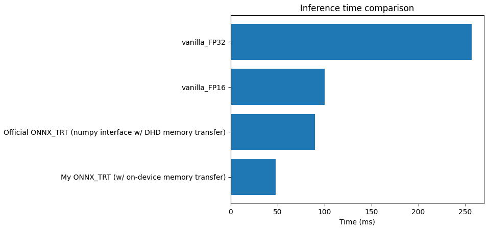

# MaskCLIP ONNX

Modified version of [CLIP](https://github.com/openai/CLIP) with several useful features

- support for dense patch-level feature extraction (based on [MaskCLIP](https://arxiv.org/abs/2112.01071) parametrization) and interpolation of the positional encoding.
- ONNX export
- TensorRT acceleration

To install, please refer to [INSTALL.md](docs/INSTALL.md).
